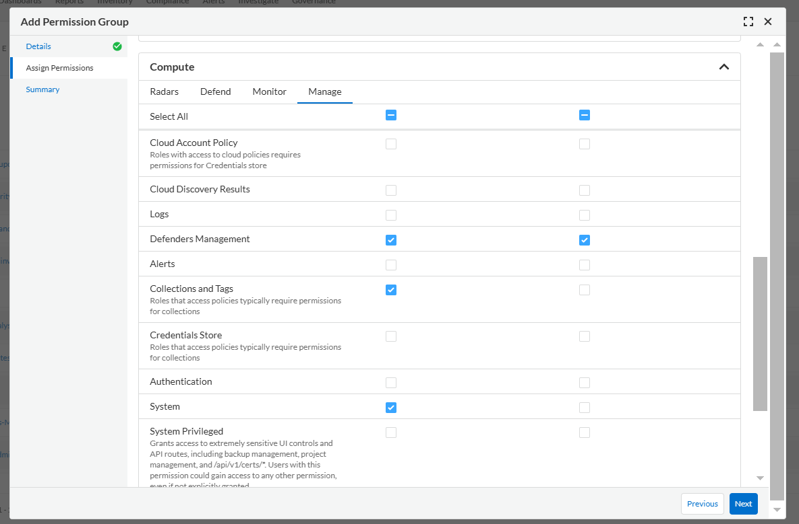
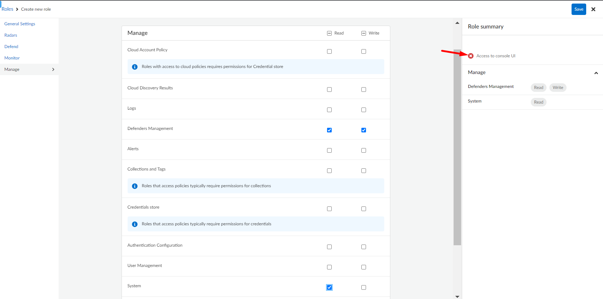

# Prisma Cloud DeamonSet Defender Auto Updater (Beta)
Kubernetes CronJob to update automatically Prisma Cloud defender DaemonSet in a kubernetes cluster.

## Requirements
1. Prisma Cloud Enterprise or self-hosted version
2. Kubernetes Cluster on a public or private cloud (EKS + Fargate not supported)
3. Access to Kubernetes cluster on current workstation via kubectl or helm
4. Kubernetes storage class (Public cloud providers regularly does have this)
5. Docker Image Registry

> NOTE
> * This process was tested on GCP Artifact Registry.
> <br></br>

## Installation
### 1. Build Image
First you need to create your own Docker image. For that you'll need to download the following files:

* checkDefenderUpdate.py
* requirements.txt
* Dockerfile

You can also clone this repo if needed.

After you've downloaded the files, build the image and push it to you own Image Registry:

```bash
$ docker build -t ${REGISTRY}/${IMAGE_NAME}:${IMAGE_TAG} .
$ docker push ${REGISTRY}/${IMAGE_NAME}:${IMAGE_TAG}
```

For MacOS is recommended to add the flag *--platform=linux/amd64* to the build command as follows:

```bash
$ docker build --platform=linux/amd64 -t ${REGISTRY}/${IMAGE_NAME}:${IMAGE_TAG} .
```

### 2. Install CronJob
You can install either via helm or kubectl. Helm is recommended.

#### Helm Method
To install the CronJob via helm, first create a *values.yaml* file like the following:

```yaml
compute:
  api_endpoint: https://us-east1.cloud.twistlock.com/us-1-123456789
  username: ${PRISMA_USERNAME}
  password: ${PRISMA_PASSWORD}
 
job:
  schedule: "0 0 * * Sun"
  timezone: "America/Los_Angeles"
  image_name: ${REGISTRY}/${IMAGE_NAME}:${IMAGE_TAG}
  image_pull_secret: twistlock-updater-pull-secret
  pull_secret_dockerconfigjson: ${DOCKER_CONFIG}

defender:
  collect_pod_labels: true
  monitor_service_accounts: true
```
Substitute the variables for current values.

Once done install the helm chart using the following command:

```bash
$ helm upgrade --install -n twistlock -f values.yaml --create-namespace twistlock-updater https://raw.githubusercontent.com/PaloAltoNetworks/pcs-cwp-defender-updater/main/Chart/twistlock-updater-helm.tar.gz
```

If you want to run the job to execute the defender auto-updater when executing a ```helm install``` or a ```helm upgrade```, set the value *job.start_now* to *true* as follows:

```yaml
job:
  start_now: true
```

If you want to delete all the created resources by the job when executing a ```helm uninstall```, set the value *job.delete_all* to *true* as follows:

```yaml
job:
  delete_all: true
```

In case if the ```helm uninstall``` fails, run the next commands to delete chart:
```bash
$ helm uninstall twistlock-updater -n twistlock --no-hooks
$ kubectl delete job twistlock-updater-delete -n twistlock
```

For more parameters that the *values.yaml* file can support, please refer on this repository to the file *Chart/twistlock-updater-helm/values.yaml*.


#### Kubectl Method
As reference you could use the file *twistlock-updater.yaml* found on this repository. Just substitute the values of the variables **PRISMA_USERNAME**, **PRISMA_PASSWORD**, **DOCKER_CONFIG**, **IMAGE_NAME** and **COMPUTE_API_ENDPOINT** found on this file, adjust as needed (like removing the ConfigMap **daemonset-extra-config** from the document and it's mounted volume in the CronJob manifest) and apply such a file.

```bash
$ kubectl apply -f twistlock-updater.yaml
```

The variables **PRISMA_USERNAME**, **PRISMA_PASSWORD** and **DOCKER_CONFIG** must be encoded in base64.


## Least privilege permissions
### Prisma Cloud SaaS version
In order to grant the least privileges to a user or service account in the SaaS version of Prisma Cloud, you must create a Permissions Group with View and Update for the Defenders Management permission and View for System permission. While you are creating a Permissions Group, the Defenders Management and System permissions can be found under **Assing Permissions** > **Compute** > **Manage** as in the following image:



Once created this permissions group, you must create a role and then the belonging user or service account.

>**NOTE**
> * You must assing an account group to the role. Be sure to add the account groups of the accounts you need to modify. 
> * Is recommended to use a service account and access key.
> <br/><br/>

### Prisma Cloud self-hosted version
In order to grant the least privileges to a user in the self-hosted version of Prisma Cloud, you must create a role with Read and Write for the Defenders Management permission, Read for System permission and no access to the Console IU. While you are creating a Role, the Collections and Tags permission can be found under the Manage tab as in the following image:



Once created this role, you must create the belonging user.

