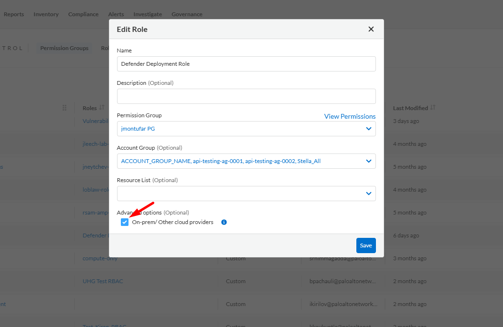
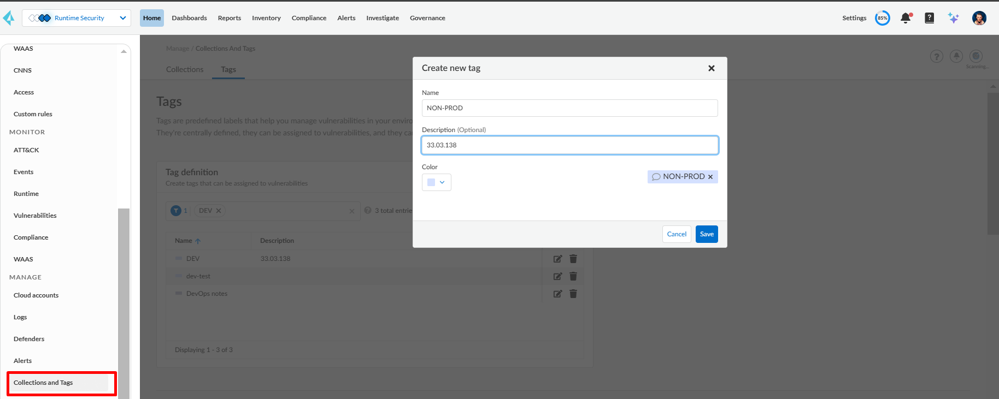

# Prisma Cloud DeamonSet Defender Auto Updater (Beta)

Kubernetes CronJob to update automatically Prisma Cloud defender DaemonSet in a Kubernetes cluster or OpenShift cluster.

## Requirements

1. Prisma Cloud Enterprise or self-hosted version
2. Kubernetes or OpenShift Cluster on a public or private cloud (EKS with Fargate is not supported)
3. Access to Kubernetes cluster on current workstation via kubectl or helm
4. Kubernetes storage class (Public cloud providers regularly does have this)
5. Docker Image Registry

> NOTE
>
> * This process was tested on GCP Artifact Registry and Azure Container Registry.
> * If you are using the public helm chart, **update to the latest version and include the file prismaapi.py** in the build phase of your image, which is not requiring persistant volume to execute rollback.

## Pre-requisites

### Prisma Cloud SaaS Service Account

In Prisma Cloud SaaS version go to **Settings** > **Access Control** > **Add** > **Permissions Group**. Here you must create a Permissions Group with View and Update for the Defenders Management permission and View for System permission. While you are creating a Permissions Group, the Defenders Management and System permissions can be found under **Assing Permissions** > **Compute** > **Manage** as in the following image:


Once created this permissions group, you must create a role with access to **ALL** the Account Groups and On-Prem and Other Cloud Providers:



Then create its corresponding service account and access key.

The values of the access key and secret key of this service account must be the values assigned to *compute.username* and *compute.password* of the helm chart respectively.

### Prisma Cloud self-hosted user

If you are using the self-hosted version of Prisma Cloud, you must create a role with Read and Write for the Defenders Management permission, Read for System permission and no access to the Console IU. While you are creating a Role, the Collections and Tags permission can be found under the Manage tab as in the following image:


Once created this role, you must create the belonging local user. The values of the username and password of this user must be the values assigned to *compute.username* and *compute.password* of the helm chart respectively.

## Workflow

The updater works as the following:

1. Checks if there is an existing version of the defender. If there is, then it generates a backup.
2. On the first execution (Start Job) it will install the defender whether the cluster has a defender installed already or not. The reason of this, is because the defender parameters can change. The version to be installed by default it's the latest version unless you specify a Prisma Cloud vulnerability tag as explained next in the [Version Control](#version-control) section.
3. Once the installation is being executed, it will check if the defender is connected or not\, using the name of the node where the Job is being executed. If the defender is not connected, then it will execute a rollback if there was a defender installed before, else will quit the process. By default the name of the node to be used for checking the status will be obtained from kubernetes, else you can also specify it as explained next in the [Status Check](#status-check) section.
4. On the scheduled executions (Cron Jobs) it will execute the same process, but it will check if the versions of the defender installed match with the latest version or the version predifined. If there's a match, then no installation and rollback will be executed.

## Installation

### 1. Build Image

First you need to create your own Docker image. For that you'll need to download the following files:

* deleteJob.py
* checkDefenderUpdate.py
* prismaapi.py
* requirements.txt
* Dockerfile

You can also clone this repo if needed.

After you've downloaded the files, build the image and push it to you own Image Registry:

```bash
$ docker build -t ${REGISTRY}/${IMAGE_NAME}:${IMAGE_TAG} .
$ docker push ${REGISTRY}/${IMAGE_NAME}:${IMAGE_TAG}
```

For MacOS is recommended to add the flag *--platform=linux/amd64* to the build command as follows:

```bash
$ docker build --platform=linux/amd64 -t ${REGISTRY}/${IMAGE_NAME}:${IMAGE_TAG} .
```

### 2. Setup Values file

If using Helm as installation method (recommended) therefore create first create a *values.yaml* file like the following:

```yaml
compute:
  api_endpoint: ${COMPUTE_API_ENDPOINT}
  username: ${PRISMA_USERNAME}
  password: ${PRISMA_PASSWORD}
 
job:
  schedule: "0 0 * * Sun"
  timezone: "America/Los_Angeles"
  image_name: ${REGISTRY}/${IMAGE_NAME}:${IMAGE_TAG}
  registry:
    name: ${REGISTRY}
    username: ${REGISTRY_USERNAME}
    password: ${REGISTRY_PASSWORD}

defender:
  collect_pod_labels: true
  monitor_service_accounts: true
```

The values to substitute are:

- **COMPUTE_API_ENDPOINT**: The endpoint of the Compute Console. Can be found in Prisma Cloud Compute console under Manage > System > Utilities > Path to the Console.
- **PRISMA_USERNAME**: Access Key of the Service Account created in Prisma Cloud.
- **PRISMA_PASSWORD**: Secret Key of the Service Account created in Prisma Cloud.
- **REGISTRY**: Name of the registry where the Defender Updater image is located.
- **IMAGE_NAME**: Name of the Defender Updater image.
- **IMAGE_TAG**: Tag of Defender Updater the image.
- **REGISTRY_USERNAME**: Name of the user used to access to the registry where the Defender Image is located.
- **REGISTRY_PASSWORD**: Password of the user used to access to the registry where the Defender Image is located.

#### External Secrets Operator

If you want to use [External Secrets Operator](https://external-secrets.io/latest/) to handle your secrets, then do the following:

1. Install External Secrets Operatorm by executing the following commands:

```bash
helm repo add external-secrets https://charts.external-secrets.io
helm install external-secrets external-secrets/external-secrets -n external-secrets --create-namespace
```

2. Follow up the corresponding [guide](https://external-secrets.io/latest/provider/aws-secrets-manager/) for installing a SecretStore or ClusterSecretStore so the External Secrets Operator can retrieve the secrets. This Chart uses by default **ClusterSecretStore** since there's no attachment to the namespace where the defender is being deployed. To change it to SecretStore, set the following values in your values.yaml file:

```yaml
compute:
  secret_store:                           
    kind: SecretStore

job:
  secret_store:
    kind: SecretStore
```

3. Create the Secret with the following JSON format:

```json
{
    "COMPUTE_API_ENDPOINT":"compute.api_endpoint",
    "PRISMA_USERNAME":"compute.username",
    "PRISMA_PASSWORD":"compute.password",
    "REGISTRY":"job.registry.name",
    "REGISTRY_USER":"job.registry.user",
    "REGISTRY_PASS":"job.registry.password"
}
```

You **must** substitute the values by the ones corresponding to your defender updater deployment.

For Azure Key vault, you require to set the **content type** to **application/json**.

4. Create the values file as the following:

```yaml
compute:
  secret_store:
    name: ${SECRETSTORE_NAME}
    remote_key: ${SECRET_NAME}
 
job:
  schedule: "0 0 * * Sun"
  timezone: "America/Los_Angeles"
  image_name: ${REGISTRY}/${IMAGE_NAME}:${IMAGE_TAG}
  secret_store:
    name: ${SECRETSTORE_NAME}
    remote_key: ${SECRET_NAME}

defender:
  collect_pod_labels: true
  monitor_service_accounts: true
```

Substitute the following values:

- **SECRETSTORE_NAME**: Name of the SecretStore object created previously.
- **SECRET_NAME**: Name of the secret in the external source.
- **REGISTRY**: Name of the registry where the Defender Updater image is located.
- **IMAGE_NAME**: Name of the Defender Updater image.
- **IMAGE_TAG**: Tag of Defender Updater the image.

#### **Version Control**

To control the version of defender that is being installed, this process use Prisma Cloud vulnerability tags. Therefore to archive this you must create a tag in the Compute Console under **Manage** > **Collections & Tags** > **Tags** > **Tag definition** > **Add tag**:



The values should be:

- **Name**: Any name of your preference. It can be referenced to a particular environment
- **Description**: the version of defender to be installed. Should use **dots**

Once done then you need to reference the name of the tag in the value *defender.version_tag* as in the following example:

```yaml
defender:
  version_tag: NON-PROD
```

Using this, you can upgrade in a more controlled manner and upgrade only spacific clusters that are using this tag.

#### Status Check

You can specify the name of the node to be queried to check for the defender status by setting the value *defender.node_name* as the following example:

```yaml
defender:
  node_name: my-node
```

But if you are using **EKS**, **AKS** or **GKE** this value is **not** required.

#### **Use Cases**

* **OpenShift**: For OpenShift cluster please add the following values:

```yaml
defender:
  orchestrator: openshift
  container_runtime: crio
  selinux: true
```

* **StartJob**: By default it creates a Job to install the defender when executing a `helm install` or `helm upgrade`. If you want to disable this behavior, set the value *job.start_now* to *false* as follows:

```yaml
job:
  start_now: false
```

* **DeleteJob**: By default it creates a Job to uninstall the defender when executing a `helm uninstall`. If you want to disable this behavior, set the value *job.delete_all* to *false* as follows:

```yaml
job:
  delete_all: false
```

* **Disable CronJob**: If you want to disable the CronJob creation, then set the value *job.cronjob_enabled* to *false* as follows:

```yaml
job:
  cronjob_enabled: false
```

### 3. Install CronJob

Once setup your *values.yaml* file, install the helm chart using the following command:

```bash
$ helm upgrade --install -n twistlock -f values.yaml --create-namespace --repo https://paloaltonetworks.github.io/pcs-cwp-defender-updater twistlock-updater twistlock-updater
```

#### **Troubleshooting**

In case if perfomed the installation via helm and you want to uninstall it but the ``helm uninstall`` fails, run the next commands to delete chart:

```bash
$ helm uninstall twistlock-updater -n twistlock --no-hooks
$ kubectl delete job twistlock-updater-delete -n twistlock
```

For more parameters that the *values.yaml* file can support, please refer on this repository to the file *Chart/twistlock-updater-helm/values.yaml*.
