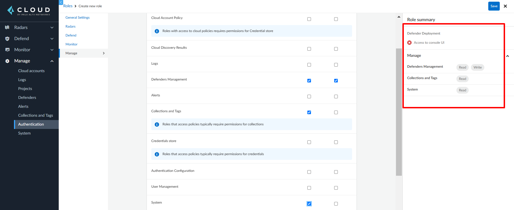

# Prisma Cloud DeamonSet Defender Auto Updater (Beta)
Kubernetes CronJob to update automatically Prisma Cloud defender DaemonSet in a Kubernetes cluster or OpenShift cluster.

## Requirements
1. Prisma Cloud Enterprise or self-hosted version
2. Kubernetes or OpenShift Cluster on a public or private cloud (EKS + Fargate not supported)
3. Access to Kubernetes cluster on current workstation via kubectl or helm
4. Kubernetes storage class (Public cloud providers regularly does have this)
5. Docker Image Registry

> NOTE
> * This process was tested on GCP Artifact Registry and Azure Container Registry.
> <br></br>

## Pre-requisites
### Prisma Cloud SaaS Service Account
In Prisma Cloud SaaS version go to **Settings** > **Access Control** > **Add** > **Permissions Group**. Here you must create a Permissions Group with View and Update for the Defenders Management permission and View for System permission. While you are creating a Permissions Group, the Defenders Management and System permissions can be found under **Assing Permissions** > **Compute** > **Manage** as in the following image:


Once created this permissions group, you must create a role with access to On-Prem and Other Cloud Providers and its corresponding service account. The values of the access key and secret key of this service account must be the values assigned to *compute.username* and *compute.password* of the helm chart respectively.

### Prisma Cloud self-hosted user
If you are using the self-hosted version of Prisma Cloud, you must create a role with Read and Write for the Defenders Management permission, Read for System permission and no access to the Console IU. While you are creating a Role, the Collections and Tags permission can be found under the Manage tab as in the following image:



Once created this role, you must create the belonging local user. The values of the username and password of this user must be the values assigned to *compute.username* and *compute.password* of the helm chart respectively.

## Installation
### 1. Build Image
First you need to create your own Docker image. For that you'll need to download the following files:

* deleteJob.py
* checkDefenderUpdate.py
* requirements.txt
* Dockerfile

You can also clone this repo if needed.

After you've downloaded the files, build the image and push it to you own Image Registry:

```bash
$ docker build -t ${REGISTRY}/${IMAGE_NAME}:${IMAGE_TAG} .
$ docker push ${REGISTRY}/${IMAGE_NAME}:${IMAGE_TAG}
```

For MacOS is recommended to add the flag *--platform=linux/amd64* to the build command as follows:

```bash
$ docker build --platform=linux/amd64 -t ${REGISTRY}/${IMAGE_NAME}:${IMAGE_TAG} .
```

### 2. Setup Values file
If using Helm as installation method (recommended) therefore create first create a *values.yaml* file like the following:

```yaml
compute:
  api_endpoint: https://us-east1.cloud.twistlock.com/us-1-123456789
  username: ${PRISMA_USERNAME}
  password: ${PRISMA_PASSWORD}
 
job:
  schedule: "0 0 * * Sun"
  timezone: "America/Los_Angeles"
  image_name: ${REGISTRY}/${IMAGE_NAME}:${IMAGE_TAG}
  registry:
    name: ${REGISTRY}
    username: ${REGISTRY_USERNAME}
    password: ${REGISTRY_PASSWORD}

defender:
  collect_pod_labels: true
  monitor_service_accounts: true
```
Substitute the variables for current values. The values of *compute.username* and *compute.password* are in plain text and are the Access Key and Secret Key of the Service Account created. The values of *job.registry.name*, *job.registry.username* and *job.registry.password* are required to download the Defender Updater image from the private repository.

#### External Secrets Operator
If you want to use [External Secrets Operator](https://external-secrets.io/latest/) to handle your secrets, then do the following:

1. Install External Secrets Operatorm by executing the following commands:
```bash
helm repo add external-secrets https://charts.external-secrets.io
helm install external-secrets external-secrets/external-secrets -n external-secrets --create-namespace
```

2. Follow up the corresponding [guide](https://external-secrets.io/latest/provider/aws-secrets-manager/) for installing a SecretStore or ClusterSecretStore so the External Secrets Operator can retrieve the secrets. This Chart uses by default **ClusterSecretStore** since there's no attachment to the namespace where the defender is being deployed. To change it to SecretStore, set the following values in your values.yaml file:
```yaml
compute:
  secret_store:                                 
    kind: SecretStore

job:
  secret_store:
    kind: SecretStore
```

3. Create the Secret with the following JSON format:
```json
{
    "COMPUTE_API_ENDPOINT":"compute.api_endpoint",
    "PRISMA_USERNAME":"compute.username",
    "PRISMA_PASSWORD":"compute.password",
    "REGISTRY":"job.registry.name",
    "REGISTRY_USER":"job.registry.user",
    "REGISTRY_PASS":"job.registry.password"
}
```
You **must** substitute the values by the ones corresponding to your defender updater deployment. 

For Azure Key vault, you require to set the **content type** to **application/json**.

4. Create the values file as the following:
```yaml
compute:
  secret_store:
    name: ${SECRETSTORE_NAME}
    remote_key: ${SECRET_NAME}
 
job:
  schedule: "0 0 * * Sun"
  timezone: "America/Los_Angeles"
  image_name: ${REGISTRY}/${IMAGE_NAME}:${IMAGE_TAG}
  secret_store:
    name: ${SECRETSTORE_NAME}
    remote_key: ${SECRET_NAME}

defender:
  collect_pod_labels: true
  monitor_service_accounts: true
```

Substitute the following values:
- **compute.secret_store.name**: Name of the SecretStore created to store the Prisma Cloud Service Account credentials. Can be the same as *job.secret_store.name*
- **compute.secret_store.remote_key**: Name of the secret created to store the Prisma Cloud Service Account credentials. Can be the same as *job.secret_store.remote_key*
- **job.secret_store.name**: Name of the SecretStore created to store the credentials to download the updater image. Can be the same as *compute.secret_store.name*
- **job.secret_store.remote_key** Name of the secret created to store the credentials to download the updater image. Can be the same as *compute.secret_store.remote_key*

**Use Cases**
* **OpenShift**<br>
For OpenShift cluster please add the following values:
```yaml
defender:
  orchestrator: openshift
  container_runtime: crio
  selinux: true
```
* **StartJob**<br>
By default it creates a Job to install the defender when executing a `helm install` or `helm upgrade`. If you want to disable this behavior, set the value *job.start_now* to *false* as follows:

```yaml
job:
  start_now: false
```
* **DeleteJob**<br>
By default it creates a Job to uninstall the defender when executing a `helm uninstall`. If you want to disable this behavior, set the value *job.delete_all* to *false* as follows:

```yaml
job:
  delete_all: false
```
* **Disable CronJob**<br>
If you want to disable the CronJob creation, then set the value *job.cronjob_enabled* to *false* as follows:
```yaml
job:
  cronjob_enabled: false
```

* **Add Persistant Volume**<br>
A Persistant Volume can be used to store state information and rollback capabilities. This is being used by the CronJob and StartJob.<br></br>
By adding the Persistant Volume, it will have the capability to rollback to the previous version. Without this the Start Job will install the defender anyways and the CronJob will verify only if the existing installed Defender version matches with the Compute Console version. 

To add the Persistant Volume used for the CronJob and start Job, set the value *job.has_volume* to *true* as follows:
```yaml
job:
  has_volume: true
```

### 3. Install CronJob
You can install either via helm or kubectl. Helm is recommended.

#### Helm Method
Once setup your values file, install the helm chart using the following command:

```bash
$ helm upgrade --install -n twistlock -f values.yaml --create-namespace --repo https://paloaltonetworks.github.io/pcs-cwp-defender-updater twistlock-updater twistlock-updater
```

#### Kubectl Method
As reference you could use the file *twistlock-updater.yaml* found on this repository. Just substitute the values of the variables **PRISMA_USERNAME**, **PRISMA_PASSWORD**, **DOCKER_CONFIG**, **IMAGE_NAME** and **COMPUTE_API_ENDPOINT** found on this file, adjust as needed (like removing the ConfigMap **daemonset-extra-config** from the document and it's mounted volume in the CronJob manifest) and apply such a file.

```bash
$ kubectl apply -f twistlock-updater.yaml
```

The variables **PRISMA_USERNAME**, **PRISMA_PASSWORD** and **DOCKER_CONFIG** must be encoded in base64.


**Troubleshooting**<br>
In case if perfomed the installation via helm and you want to uninstall it but the ```helm uninstall``` fails, run the next commands to delete chart:
```bash
$ helm uninstall twistlock-updater -n twistlock --no-hooks
$ kubectl delete job twistlock-updater-delete -n twistlock
```

For more parameters that the *values.yaml* file can support, please refer on this repository to the file *Chart/twistlock-updater-helm/values.yaml*.